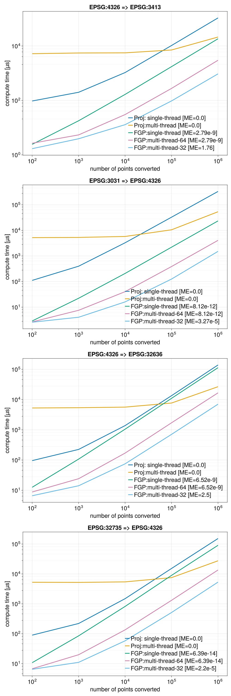

**FastGeoProjections** is intended to provide highly optimized native Julia geospatial coordinate transformations from one coordinate reference system (CRS) to another as defined by EPSG codes. It is not intended to to replace or to be as comprehensive as [Proj](https://github.com/JuliaGeo/Proj.jl). The package will natively support only the most common geospatial transformations and relies on **Proj.jl** for all others.

Benchmark of currently implemented EPSGs [ME = Maximum Error]

**FastGeoProjections**