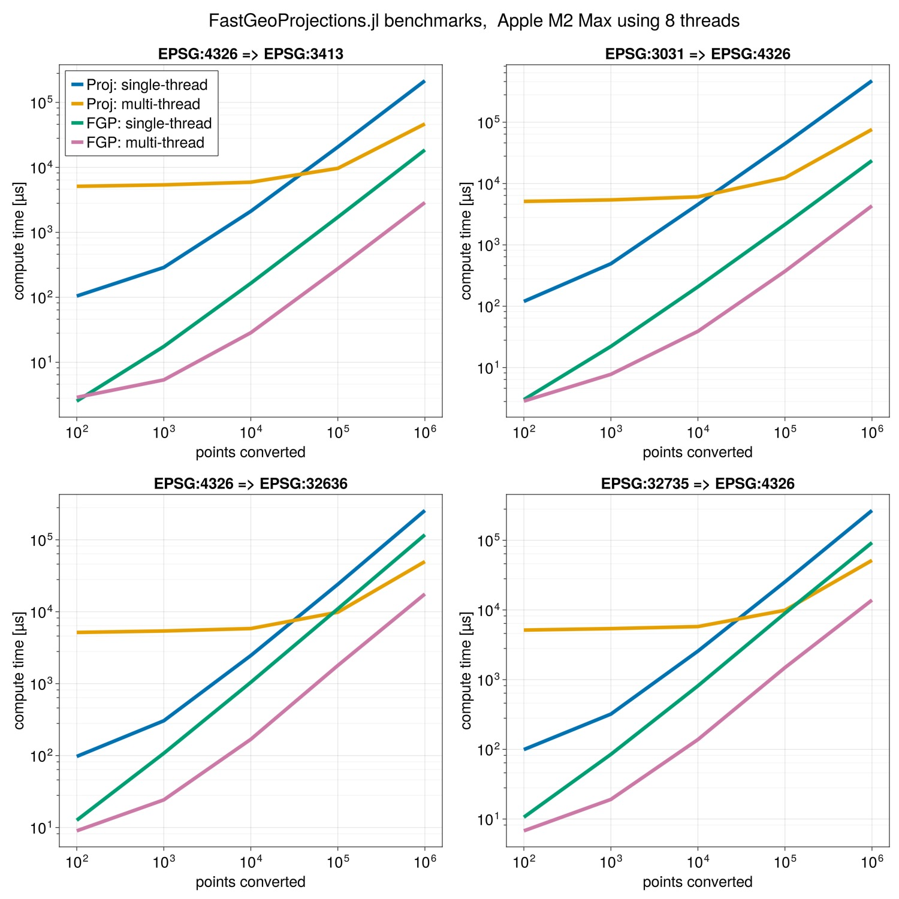

[](https://github.com/alex-s-gardner/FastGeoProjections.jl/actions/workflows/CI.yml?query=branch%3Amain)

**FastGeoProjections** is intended to provide highly optimized native Julia geospatial coordinate transformations from one coordinate reference system (CRS) to another as defined by EPSG codes. It is not intended to replace, nor to be as comprehensive as, [Proj](https://github.com/JuliaGeo/Proj.jl). The package will natively support only the most common geospatial transformations and relies on **Proj.jl** for all others.

*Supported Projection EPSGs*
- 3031:     WGS 84 / Antarctic Polar Stereographic
- 3413:     WGS 84 / NSIDC Sea Ice Polar Stereographic North
- 4326:     WGS84 - World Geodetic System 1984
- 326XX:    WGS 84 / UTM zone XXN
- 327XX:    WGS 84 / UTM zone XXS

*Example*
```julia
julia> FastGeoProjections
julia> lat = [84.0, 83.0]; lon = [50.0, 51.0];
julia> trans = FastGeoProjections.Transformation(EPSG(4326), EPSG(3413))
Transformation
    source_epsg:    EPSG(4326)
    target_epsg:    EPSG(3413)
    threaded:       true
    always_xy:      false
    proj_only:      false
julia> x, y = trans(lat, lon)
([648059.0510298966, 755038.7580833685], [56697.82026048427, 79357.77126429843])
```

*Benchmark*

ME = Maximum Error



**Note**
If you have recommendations for additional projections to support feel free to submit a an issue