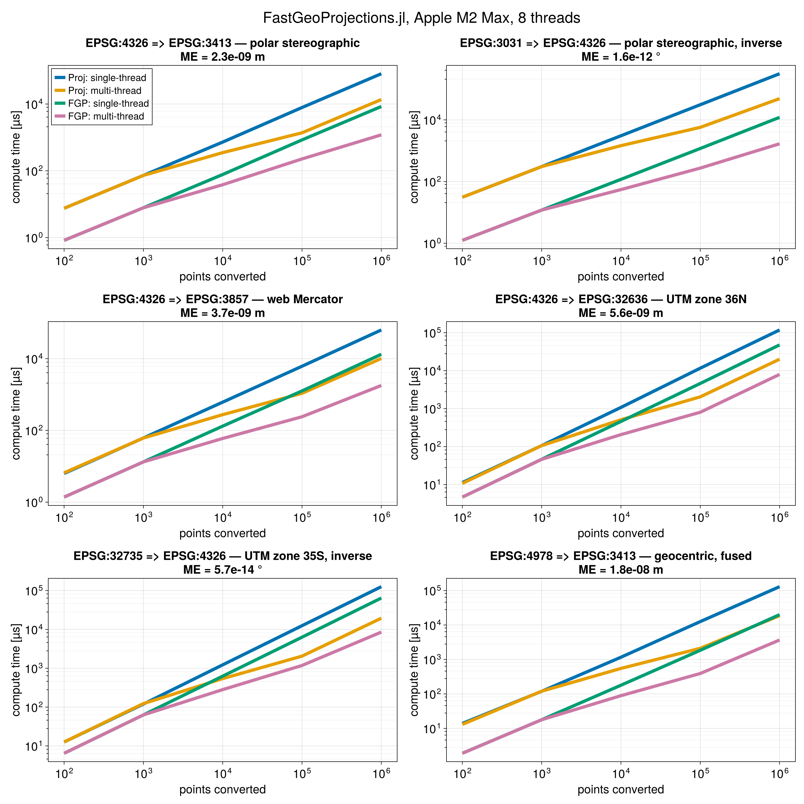

[](https://github.com/alex-s-gardner/FastGeoProjections.jl/actions/workflows/CI.yml?query=branch%3Amain)

**FastGeoProjections** is intended to provide highly optimized native Julia geospatial coordinate transformations from one coordinate reference system (CRS) to another as defined by EPSG codes. It is not intended to replace, nor to be as comprehensive as, [Proj](https://github.com/JuliaGeo/Proj.jl). The package will natively support only the most common geospatial transformations and relies on **Proj.jl** for all others.

*Supported Projection EPSGs*
- 3031:     WGS 84 / Antarctic Polar Stereographic
- 3413:     WGS 84 / NSIDC Sea Ice Polar Stereographic North
- 3857:     WGS 84 / Pseudo-Mercator (web Mercator)
- 4326:     WGS84 - World Geodetic System 1984
- 4978:     WGS 84 geocentric Cartesian (x, y, z)
- 4979:     WGS 84 geographic 3D (lon, lat, height)
- 326XX:    WGS 84 / UTM zone XXN
- 327XX:    WGS 84 / UTM zone XXS

Any pair composes, since every projection is expressed relative to EPSG:4326 — so
`EPSG(32619) => EPSG(32620)` is one pass over the data rather than two. The
geocentric pair transforms the height rather than carrying it across, so those
conversions take and return three coordinates.

*Example*
```julia
julia> using Pkg; Pkg.add("FastGeoProjections")
julia> using FastGeoProjections
julia> lat = [84.0, 83.0]; lon = [50.0, 51.0];
julia> trans = FastGeoProjections.Transformation(EPSG(4326), EPSG(3413))
Transformation
    source_epsg:    EPSG:4326
    target_epsg:    EPSG:3413
    threaded:       true
    always_xy:      false
    proj_only:      false
julia> x, y = trans(lat, lon)
([648059.0510298966, 755038.7580833684], [56697.82026048413, 79357.7712642986])
```

*Transformations are point operators*

A `Transformation` is a callable struct that maps **one point to one point**, holding
everything the projection can precompute. The same operator is what gets applied to whole
collections, so there is one implementation of the projection rather than one per calling
convention:

```julia
julia> trans = FastGeoProjections.Transformation(EPSG(4326), EPSG(3413); always_xy=true)

julia> trans(-45.0, 70.0)                   # two coordinates
(0.0, -2.1879276492790217e6)

julia> points = [(-45.0, 70.0), (-44.0, 71.0)];
julia> transform(trans, points)             # a vector of points
julia> transform!(trans, points)            # ...or in place
julia> transform(trans, lon, lat)           # ...or as two coordinate vectors
```

A single argument is read as a [GeoInterface](https://github.com/JuliaGeo/GeoInterface.jl)
point, so anything with `PointTrait` works -- including the plain tuples the array API
uses. Only `x` and `y` are used; `z` is ignored.

```julia
julia> trans((-45.0, 70.0)) == trans(GI.Point(-45.0, 70.0)) == trans(-45.0, 70.0)
true
```

Vectors of GeoInterface points go the same way, and at full speed. A vector of isbits
points is already a dense interleaved buffer of coordinates, so the SIMD path reads and
writes it in place, column by column -- `SVector{2}`, `GeometryBasics.Point2`, a two-field
struct of your own and `NTuple{2}` all run at the same ns/point:

```julia
julia> transform(trans, [Point2(-45.0, 70.0), Point2(-44.0, 71.0)])
julia> transform!(trans, [SVector(-45.0, 70.0), SVector(-44.0, 71.0)])
```

A third component costs nothing (the load deinterleaves in hardware) and is carried
through untouched, so `Point3` and `NTuple{3}` keep their `z`. Whether that layout really
holds is settled from the point *type*, by laying sentinel coordinates out in memory and
asking the resulting point where its x and y are. GeoInterface cannot answer it:
`getcoord` may read out of a C API, with no Julia-side memory to be ordered, and
`coordnames` names coordinates rather than describing storage. A point type that stores
its components in the other order is transformed one at a time instead -- correctly,
about half as fast. Such a type needs a `FastGeoProjections.rebuildpoint(::Type{P}, x, y)`
method, since the scalar path has to construct each result.

Pipelines are flat. `f ∘ g ∘ h` is one `ComposedGeoTransformation` holding a tuple of
stages in application order, not a tree of nested pairs, so a pipeline of any length
inlines into a single pass over the data:

```julia
julia> FastGeoProjections.Transformation(EPSG(4326), EPSG(32619)).f
LonLatToUTM{Float64}(zone = 19, north) ∘ FastGeoProjections.SwapXY()
```

Because the operator is generic over its scalar type, it is evaluated on SIMD lanes rather
than one point at a time, which is what makes the point-by-point form as fast as a hand
vectorized array kernel. Threading is a property of the *application*, not of the
transformation, and can be set per call:

```julia
julia> transform!(trans, points; threaded=false)
```

`transform`/`transform!` fall back to a plain scalar loop for any transformation that
cannot be vectorized -- one backed by Proj, or one built with `kernel=BaseKernel()`.

*Projections on their own*

The projections are usable directly, without going through an EPSG pair:

Each is named for what it does, source to target:

```julia
julia> tm = LonLatToTransverseMercator(; lon0 = -69.0, lat0 = 0.0)
julia> tm(-68.0, 45.0)
(78846.84165337228, 4.985430940725587e6)

julia> inv(tm)                                 # TransverseMercatorToLonLat
julia> convergence_scale(tm, -68.0, 45.0)      # meridian convergence [°], point scale
(0.7071430455192697, 1.0000764118961945)
```

UTM is its own operator, carrying the zone and hemisphere as fields and folding the
zone scale factor and false origin into its constants:

```julia
julia> u = LonLatToUTM(19, true)
LonLatToUTM{Float64}(zone = 19, north)

julia> u(-69.0, 45.0)
(500000.0, 4.982950400226552e6)

julia> convergence_scale(u, -69.0, 45.0)       # k includes the 0.9996 zone factor
(0.0, 0.9995999999999999)
```

Web Mercator takes no parameters. It is a spherical Mercator on the WGS 84 semi-major
axis, which is the definition EPSG:3857 gives -- the latitude is used unchanged rather
than converted to a conformal one, and the ellipsoid enters only through the radius:

```julia
julia> LonLatToWebMercator()(-45.0, 70.0)
(-5.009377085697311e6, 1.1068715659379493e7)
```

*Heights*

A map projection is a function of x and y, so a third coordinate passes through it
untouched. The geocentric conversions are not: a geocentric z is a Cartesian coordinate,
and x and y depend on the height going in. Both directions therefore take and return
three coordinates, and a two-coordinate call is an error rather than an implied
sea-level point, which would move x and y by metres:

```julia
julia> LonLatToGeocentric()(5.39, 52.16, 100.0)
(3.9036404612786868e6, 368315.27616670664, 5.013823349039822e6)

julia> LonLatToGeocentric()(5.39, 52.16)
ERROR: ArgumentError: LonLatToGeocentric transforms (lon, lat, height); ...
```

`preservesz(t)` answers which kind `t` is, and `transform`/`transform!` consult it before
carrying a z across: rather than return a height it cannot compute, a whole-array call
refuses to run. Proj-backed transformations report `false` too, since the pipeline Proj
resolves may be a datum shift.

Composing a geocentric stage with a projection would form `atan(z, d)` and `atan(y, x)`
and immediately take their sines and cosines. Where the projection after it can consume
the direction directly, `pipeline` substitutes a fused operator that never forms the
angles -- the same function to within a few ulps, at roughly half the cost:

```julia
julia> FastGeoProjections.Transformation(EPSG(4978), EPSG(3413); always_xy=true).f
LonLatToPolarStereographic{Float64}(lon_0 = -45.0°) ∘ GeocentricToLonLat{Float64}(WGS_84) [fused]
```

*Math kernels*

The transcendental functions a projection uses live in a `Math` submodule and take the
back-end as their first argument, so one implementation serves all of them:

```julia
julia> Math.sin(FastKernel(), 0.5)
```

`FastKernel` (the default) is SLEEFPirates' `*_fast` family -- what `@turbo` silently
lowered to. `SLEEFKernel` is the same routines with full argument reduction: sub-ULP
anywhere, at about twice the cost, and identical in practice over the ranges a
projection produces. `BaseKernel` is libm, which does not vectorize.

*Ahead-of-time compilation*

The projections compile with [`juliac`](https://docs.julialang.org/en/v1/devdocs/build/juliac/)
into a standalone executable -- no Julia startup, no JIT.
[`examples/juliac`](examples/juliac) is a CSV reprojection tool built that way;
its README covers the two patterns that make an app on this package trimmable,
and what does not survive `--trim`.

```console
$ ./fastgeoproj --input points.csv --from 4326 --to 32619 --always-xy
```

*Benchmark*

Throughput against Proj, and the largest disagreement with it (ME) over the same points.
Apple M2 Max, 8 threads, one million points, out of place, `always_xy=true`. Reproduce with
`julia --project=benchmark --threads=8 benchmark/benchmark.jl`.

| pipeline | Proj, 1 thread | Proj, 8 | FGP, 1 thread | FGP, 8 | ME |
|---|---|---|---|---|---|
| 4326→3413 polar stereographic | 81 | 14 | 8.4 | 1.2 | 2.3e-9 m |
| 3031→4326 polar stereographic, inverse | 313 | 49 | 12 | 1.7 | 1.6e-12 ° |
| 4326→3857 web Mercator | 63 | 10 | 13 | 1.8 | 3.7e-9 m |
| 4326→32636 UTM zone 36N | 118 | 20 | 48 | 8.0 | 5.6e-9 m |
| 32735→4326 UTM zone 35S, inverse | 126 | 19 | 64 | 8.5 | 5.7e-14 ° |
| 4978→3413 geocentric, fused | 130 | 19 | 20 | 3.7 | 1.8e-8 m |

Times are ns/point. The gap narrows above one thread, since Proj threads as well; it is the
single-thread column that shows what the native implementation costs.

The geocentric row compares the projected x and y only. Proj's own geocentric inverse loses
accuracy in the height it returns — 8.8e-7 m over a −400 m to 8 km range, against 3.9e-9 m here —
so the height is pinned against an exactly computed position in the test suite rather than
against Proj.



*Related packages*

- [**Proj.jl**](https://github.com/JuliaGeo/Proj.jl) wraps PROJ, and is what this package
  falls back to for any CRS pair it has no native implementation for. Comprehensive where
  this is narrow, and the reference every native projection here is asserted against.
- [**Geodesy.jl**](https://github.com/JuliaGeo/Geodesy.jl) is native Julia and covers the
  datum-level conversions — geodetic to ECEF and to a local ENU or UTM frame — without a
  PROJ dependency. It overlaps this package at the geocentric conversions (EPSG:4978 and
  4979) and at UTM, and is the better fit for local-frame work, which this package does not
  do at all. Useful as an independent check on the geocentric math for exactly that reason:
  a second unrelated formulation catches what a single implementation's own round trip
  cannot.

**Note**
If you have recommendations for additional projections to support feel free to submit a an issue